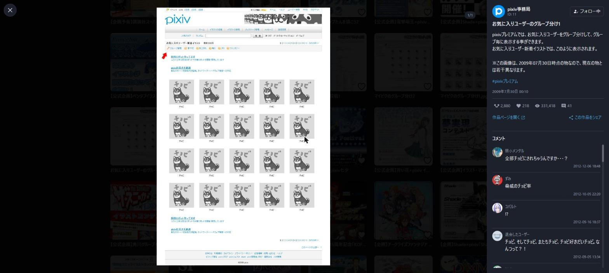
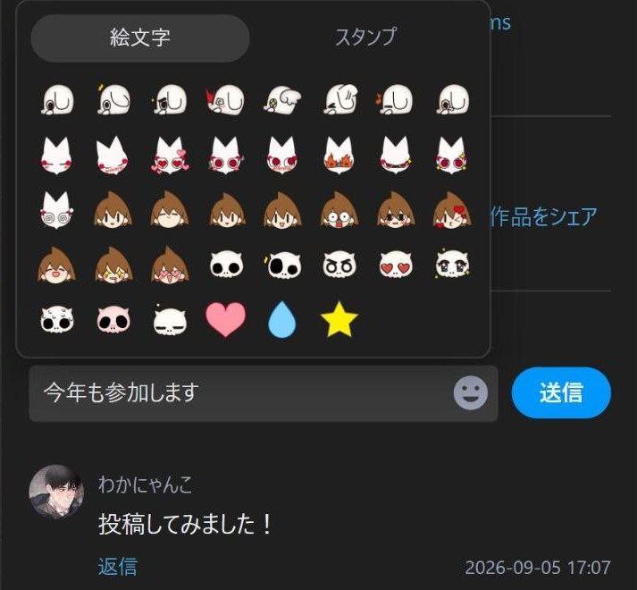

<div align="center">


# XViewer for Pixiv

**pixiv 유저 페이지·홈·검색 결과에 X.com의 미디어 보기와 비슷한 이미지 뷰어를 추가하는 브라우저 확장 프로그램**

[](package.json)
[](LICENSE)


**[소개 사이트](https://xviewer.neonsdesign.com/ko/)** ・
[개인정보보호방침](https://xviewer.neonsdesign.com/ko/privacy.html) ・
[日本語](README.md) ・
[English](README.en.md) ・
[简体中文](README.zh-CN.md) ・
[繁體中文](README.zh-TW.md)

</div>

---

> [!NOTE]
> 이 문서는 [README.md](README.md)(일본어)를 참고용으로 번역한 것입니다.
> 확장 프로그램 자체는 한국어로 사용할 수 있습니다. ([지원 언어](#지원-언어) 참고)

---

> [!IMPORTANT]
> **이 확장 프로그램은 pixiv 플랫폼을 이용하여 개발한 비공식 확장 프로그램입니다.**
> **pixiv Inc.에서 제작·배포하는 애플리케이션이 아닙니다.**
> 이 회사와는 아무런 관계가 없으며, 제휴·지원·추천을 받은 것도 아닙니다.
> 이용으로 인해 발생하는 모든 결과에 대해서는 이용자 본인이 책임을 집니다.

---

## 무엇인가요

pixiv 유저 페이지·홈·검색 결과에서 작품을 클릭하면 **페이지를 이동하지 않고 그 자리에서 모달이 열립니다.**
여러 장의 이미지 전환, 움짤(우고이라) 재생, 작품 설명과 댓글 보기부터 좋아요·북마크·팔로우·
댓글 작성까지 모달 안에서 모두 할 수 있습니다. 닫으면 원래 그리드의 원래 스크롤 위치로 돌아갑니다.


## 주요 기능

### 뷰어

| | |
| --- | --- |
| **모달로 열기** | 그리드의 클릭을 가로채 페이지를 이동하지 않고 표시한다. 유저 페이지의 작품 목록뿐 아니라 홈과 검색 결과(태그 페이지와 검색 화면)의 작품에서도 열 수 있다. URL은 `/artworks/{id}`로 바뀌므로 새로고침이나 공유도 할 수 있다 |
| **여러 장 전환** | `←` `→`와 화면 가장자리의 화살표로 페이지를 넘긴다. 설정하면 화면 좌우 가장자리를 클릭해서도 넘길 수 있다. 앞뒤 이미지를 미리 불러오므로 전환이 빠르다 |
| **작품 이동** | `↑` `↓`로 그리드의 이전·다음 작품으로 이동한다. 설정하면 화면 상하 가장자리를 클릭해서도 이동할 수 있다. 유저 페이지에서는 끝에 다다르면 다음 페이지 분량을 자동으로 더 불러오고, 일러스트 / 만화 탭에서는 그 종류의 작품만 따라간다. 홈과 검색 결과에서는 누른 작품이 있는 영역 안에서 넘긴다 |
| **움짤(우고이라)** | zip을 풀어 프레임을 조립하며, 재생·일시 정지를 지원한다 |
| **원본 크기 보기** | 이미지를 클릭하면 원본 크기 그대로 화면 가득 연다. (pixiv 작품 페이지와 같은 모습) 좌우 끝 또는 `←` `→`로 페이지를 넘긴다 (기본값은 끔) |

### 사이드바

작품 설명·태그·투고일·각종 카운터·댓글이 이미지 옆에 세로 한 줄로 나열됩니다.



| | |
| --- | --- |
| **작품 정보** | 작품 설명·태그·투고일·좋아요 / 북마크 / 열람수와 작가의 아이콘·팔로우 버튼 |
| **댓글 읽기** | 스탬프와 이모지를 이미지로 그린다. 답변 펼치기와 이어서 불러오기를 지원한다. 불러오기에 실패해도 ‘다시 시도’로 이어서 읽을 수 있다 |
| **댓글 쓰기** | 작품에 대한 댓글과 답변을 모달 안에서 작성할 수 있다. 이모지와 스탬프는 패널에서 고른다. 내 댓글은 확인 단계를 거쳐 삭제할 수 있다 |
| **액션** | 좋아요, 북마크 (Shift + 클릭으로 비공개), 팔로우, 공유. (X / Facebook / Pawoo / 링크 복사) 다른 탭에서 이미 누른 좋아요는 두 번 세지 않으며, 로그인이 만료되었으면 그 사실을 알린다. 내 작품에는 세 가지 모두 표시하지 않는다 (pixiv 본체와 같음) |



### 유저 페이지

| | |
| --- | --- |
| **무한 스크롤** | 일러스트·만화 목록의 페이지 이동 (1 2 3 …)을 아래로 이어서 불러오는 방식으로 바꿀 수 있다. URL의 `?p=`는 화면에 보이는 페이지를 따라가므로, 새로고침해도 같은 위치 근처로 돌아올 수 있다 (기본값은 끔) |
| **픽업 숨기기** | 프로필 홈에 표시되는 ‘픽업’을 숨겨 작품 목록이 바로 눈에 들어오게 한다 (기본값은 끔) |
| **Tab 순서 정리** | 작품 목록(유저 페이지·홈·검색)에서 Tab을 눌렀을 때 북마크와 제목을 포커스 순서에서 뺄 수 있다. 작가 링크는 빼지 않는다 (기본값은 pixiv 기본 그대로) |

### 그 밖의 기능

| | |
| --- | --- |
| **테마** | 뷰어는 pixiv 본체의 다크 / 라이트 설정을 따른다. 설정 화면은 직접 전환할 수 있다 |
| **세세한 설정** | ‘설정’ 탭(뷰어·이미지·유저 페이지·조작)과 ‘상세 설정’ 탭(뷰어·조작·댓글)에서 뷰어를 쓸 페이지·화질·미리 불러올 장수·사이드바 표시 방식과 너비·배경 농도·무한 스크롤 등을 취향에 맞게 조정할 수 있다 |
| **접근성** | 포커스 트랩, `role="dialog"`, 그리드의 Tab 순서 정리. 키보드만으로 열고 닫을 때까지 조작할 수 있다 |

## 지원 브라우저

Manifest V3를 지원하는 Chromium 계열 브라우저. (Chrome / Brave / Edge 등) **Chrome 120 이상**이 필요합니다.
(콘텐츠 스크립트의 `"world": "MAIN"`, `color-mix()`, CSS nesting을 사용합니다)
Edge는 [Edge 추가 기능](https://microsoftedge.microsoft.com/addons/detail/pmkplomaebdlciailfpopkocnfpcdmgl)에서도 설치할 수 있습니다.
Firefox (Firefox 140 이상의 데스크톱 버전)는 [Firefox Add-ons](https://addons.mozilla.org/firefox/addon/xviewer-for-pixiv/)에서 설치할 수 있습니다. Safari는 지원하지 않습니다.

## 지원 언어

확장 프로그램의 표시 언어는 pixiv의 표시 언어에 맞춰 바뀝니다.
(설정 화면은 마지막으로 연 pixiv 페이지의 표시 언어를 따릅니다)

| 언어 | 지원 상황 |
| --- | --- |
| 일본어 | 지원 |
| 영어 | 지원 |
| 한국어 | 지원 |
| 중국어 (간체) | 지원 |
| 중국어 (번체) | 지원 |
| 태국어 | 요청 시 대응 |
| 말레이어 | 요청 시 대응 |

표는 pixiv에서 표시 언어로 선택할 수 있는 7개 언어입니다. ‘요청 시 대응’인 언어로 pixiv를 표시하고 있을 때는 영어로 표시합니다.
지원을 원하는 언어가 있으면 아래 ‘버그 신고, 질문, 요청’을 통해 알려 주세요.

## 설치

[**Chrome 웹 스토어**](https://chromewebstore.google.com/detail/xviewer-for-pixiv/hbnpmpiipnocflhikmpamobpodadfbpd)에서 설치할 수 있습니다. Brave / Edge 등 Chromium 계열 브라우저에서도 같은 스토어 페이지에서 설치할 수 있습니다.
Edge는 [**Edge 추가 기능**](https://microsoftedge.microsoft.com/addons/detail/pmkplomaebdlciailfpopkocnfpcdmgl)에서도 설치할 수 있습니다.
Firefox는 [**Firefox Add-ons**](https://addons.mozilla.org/firefox/addon/xviewer-for-pixiv/)에서 설치할 수 있습니다.

스토어를 거치지 않고 설치하려면 다음 중 한 가지 방법으로 불러오세요.

### 배포용 zip으로

1. [Releases](https://github.com/NEONS-DESIGN/XViewer-for-Pixiv/releases)에서 최신 버전의 `XViewer.for.Pixiv_x.y.z.zip`을 내려받아 압축을 푼다
2. `chrome://extensions/`를 연다
3. 오른쪽 위의 **개발자 모드**를 켠다
4. **압축해제된 확장 프로그램을 로드합니다**를 누른다
5. 압축을 푼 폴더를 선택한다

### 소스에서 빌드하여

```bash
git clone https://github.com/NEONS-DESIGN/XViewer-for-Pixiv.git
cd XViewer-for-Pixiv
npm install
npm run build
```

1. `chrome://extensions/`를 연다
2. 오른쪽 위의 **개발자 모드**를 켠다
3. **압축해제된 확장 프로그램을 로드합니다**를 누른다
4. 생성된 **`dist/`** 폴더를 선택한다

`src/`가 아니라 `dist/`를 선택하세요. 빌드한 결과물만 작동합니다.

## 사용법

pixiv의 **유저 페이지** (`https://www.pixiv.net/users/{id}` 계열)·**홈** (홈 / 일러스트 / 만화)·**검색 결과** (태그 페이지와 검색 화면)를 열고 작품을 클릭하기만 하면 됩니다.

### 키 조작

| 키 | 동작 |
| --- | --- |
| `←` `→` | 같은 작품의 페이지 넘기기 (원본 크기 보기 중에도 같음) |
| `↑` `↓` | 이전·다음 작품으로 이동 |
| `Ctrl` + `Enter` | 댓글 입력란에서 전송. (Mac은 `Cmd` + `Enter`) `Enter`는 줄바꿈 |
| `Esc` | 앞에 있는 것부터 차례로 닫는다. (이모지 패널 → 원본 크기 보기·공유 메뉴 → 모달) 작성 중인 댓글이 있으면 모달을 닫지 않는다 |
| `Tab` | 모달 안에서 포커스를 이동한다 (밖으로 나가지 않는다) |

댓글을 쓰는 동안에는 `←` `→` `↑` `↓`가 커서 이동에 쓰입니다. (작품은 바뀌지 않습니다)

### 설정

툴바의 아이콘에서 엽니다. ‘설정’ 탭과 ‘상세 설정’ 탭으로 나뉘어 있으며, 구분별로 다음 항목을 세세하게 조정할 수 있습니다.
`↳`가 붙은 항목은 위 항목의 하위 항목입니다. 전제가 되는 항목이 꺼져 있는 동안에는 그 항목을 조작할 수 없습니다.
(‘뷰어 사용’이 꺼져 있으면 뷰어에 관한 항목 전부, ‘사이드바 표시’가 꺼져 있으면 사이드바 너비와 한 번에 불러올 댓글 수,
‘화면 가장자리 클릭으로 넘기기’가 ‘사용 안 함’이면 화면 가장자리 클릭 영역 너비, ‘클릭하여 원본 크기 보기’가 꺼져 있으면 원본 크기 보기의 클릭 영역 너비)
‘라이선스’ 탭에는 면책 조항과 포함된 제3자 저작물의 고지가 나열됩니다.

**‘설정’ 탭**

| 구분 | 항목 | 기본값 | 효과 |
| --- | --- | --- | --- |
| 뷰어 | 뷰어 사용 | 켬 | 끄면 pixiv 기본 동작으로 돌아간다. 픽업 영역 숨기기·무한 스크롤·그리드의 Tab 이동은 꺼도 그대로 쓸 수 있다 |
| 뷰어 | ↳ 사용자 페이지에서 사용 | 켬 | 사용자 페이지의 작품 목록에서 열 때 뷰어를 표시한다 |
| 뷰어 | ↳ 홈에서 사용 | 켬 | pixiv 홈(홈 / 일러스트 / 만화)의 작품에서 열 때 뷰어를 표시한다 |
| 뷰어 | ↳ 검색 결과에서 사용 | 켬 | 검색 결과(태그 페이지와 검색 화면)에서 열 때 뷰어를 표시한다 |
| 뷰어 | 사이드바 표시 | 켬 | 작품 설명·태그·좋아요 수·댓글을 이미지 옆에 표시한다. 끄면 닫기 버튼 옆에 작품 페이지 링크를 표시한다. 화면이 좁을 때는 오른쪽 위 버튼으로 열 수 있다 |
| 뷰어 | ↳ 사이드바 스크롤 | 사이드바 전체 스크롤 | 작품 설명부터 댓글까지 하나로 이어서 스크롤할지, 작품 설명을 고정하고 댓글만 스크롤할지 |
| 이미지 | 이미지 해상도 | 표준 (긴 변 1200px) | 원본 크기를 고르면 선명해지지만 불러오기가 무거워진다 |
| 이미지 | 미리 불러오기 | 앞뒤 1장 | 다음 페이지를 미리 불러와 둘 장수를 사용 안 함 / 앞뒤 1장 / 앞뒤 3장 / 사용자 지정 중에서 고른다. 사용자 지정에서는 앞뒤로 불러올 장수를 1~20장 중에서 고를 수 있다 (10장 이상이면 메모리를 압박한다는 주의가 표시된다) |
| 이미지 | 앞뒤 작품도 미리 불러오기 | 끔 | `↑` `↓`로 이동할 작품을, 표시가 끝난 뒤 1개만 미리 불러온다. 이동은 빨라지지만, 이동하지 않고 닫아도 통신량이 늘어난다 |
| 이미지 | 클릭하여 원본 크기 보기 | 끔 | 이미지를 누르면 원본 크기 그대로 화면 가득 연다. 위의 해상도 설정과 관계없이 원본 크기를 불러온다 |
| 유저 페이지 | 픽업 영역 숨기기 | 끔 | 프로필 홈에 표시되는 ‘픽업’을 숨긴다 |
| 유저 페이지 | 무한 스크롤 | 사용 안 함 | 맨 아래에 닿으면 불러오기 / 항상 1페이지 앞서 불러오기 중에서 고른다 |
| 조작 | 배경 클릭으로 닫기 | 켬 | 이미지 바깥을 클릭했을 때 닫을지 |
| 조작 | 화면 가장자리 클릭으로 넘기기 | 사용 안 함 | 화면 좌우 가장자리로 페이지를, 상하 가장자리로 작품을 넘긴다. 좌우만 / 상하만 / 둘 다 중에서 고른다. 더 이상 넘길 수 없는 가장자리에서는 커서가 금지 모양으로 바뀌어, 닫히는 여백과 구별할 수 있다 |
| 조작 | 그리드의 Tab 이동 | 건너뛰지 않음 | 작품 목록(유저 페이지·홈·검색)에서 Tab을 눌렀을 때 북마크와 제목을 포커스 순서에서 뺄지. 작가 링크는 빼지 않는다 |

**‘상세 설정’ 탭**

| 구분 | 항목 | 기본값 | 효과 |
| --- | --- | --- | --- |
| 뷰어 | 사이드바 너비 | 384px | 화면이 넓을 때 오른쪽에 표시되는 사이드바의 너비. 320 / 384 / 448 / 512px 중에서 고른다 |
| 뷰어 | 꺼낸 사이드바 너비 | 60% | 화면이 좁을 때 (너비 900px 이하) 꺼낸 사이드바의, 화면 너비에 대한 상한. 50 / 60 / 70 / 80% 중에서 고른다 |
| 뷰어 | 배경 농도 | 테마에 맞추기 | 이미지 뒤에 까는 검은 막의 농도. 테마에 맞추기 (다크 92% / 라이트 88%) 또는 사용자 지정으로 0~100% (10% 단위) 중에서 고른다. 낮추면 뒤의 페이지가 비쳐 보인다 |
| 조작 | 화면 가장자리 클릭 영역 너비 | 25% | 화면 가장자리 클릭으로 넘길 때 쓰는 가장자리의 너비. 이미지를 표시하는 부분에 대한 비율이며, 사용자 지정에서는 좌우 너비와 상하 너비를 각각 5~35% (5% 단위) 중에서 고른다 |
| 조작 | 원본 크기 보기의 클릭 영역 너비 | 25% | 원본 크기 보기 화면에서 페이지를 넘길 때 쓰는 좌우 가장자리의 너비. 사용자 지정에서는 5~35% (5% 단위) 중에서 고른다 |
| 댓글 | 한 번에 불러올 댓글 수 | 30개 | 열었을 때와 ‘더보기’를 눌렀을 때 불러오는 개수. 10 / 20 / 30 / 50개 중에서 고른다. 다음에 여는 작품부터 바뀐다 |

설정 화면의 색상 구성은 오른쪽 위의 아이콘으로 다크 / 라이트를 전환할 수 있습니다. 처음에는 OS 설정을 따르며,
한 번 전환하면 이후에는 그 색상 구성으로 고정됩니다. (‘설정 초기화’로 OS 설정을 따르는 상태로 돌아갑니다)
이 색상 구성은 설정 화면에만 적용되며, 뷰어는 계속 pixiv 본체의 설정을 따릅니다.

## 주의 사항

- **이 확장 프로그램은 비공식입니다.** pixiv 플랫폼을 이용하여 개발한 것으로,
  pixiv Inc.에서 제작·배포하는 애플리케이션이 아닙니다. 이 회사와는 아무런 관계가 없습니다
- **이용은 본인의 책임입니다.** 이 확장 프로그램의 이용으로 인해 발생한 손해에 대해 제작자 및 pixiv Inc.는 책임을 지지 않습니다
- **R-18 작품의 표시는 pixiv 측의 설정을 따릅니다.** 확장 프로그램 쪽에서 연령 제한을 우회하지 않습니다
- **좋아요는 취소할 수 없습니다.** 이는 pixiv의 사양이며, 잘못 눌러도 되돌릴 수 없습니다
- **댓글의 작성·삭제는 pixiv 본체와 똑같이 취급됩니다.** 누른 만큼 그대로 pixiv로 전송됩니다.
  삭제는 되돌릴 수 없으므로 2단계 확인을 거칩니다
- **작품을 수집하는 기능은 없습니다.** 다운로드 기능도, 일괄 조작 자동화도 없습니다.
  가져오는 것은 지금 열려 있는 작품과 그 앞뒤의 몇 장뿐입니다
- **무한 스크롤은 pixiv 본체와 같은 페이지 단위로 불러옵니다.** 1페이지 (48개)씩,
  아래로 내려가는 데 맞춰 가져올 뿐이며, 작품을 한꺼번에 가져오지 않습니다
- **pixiv의 사양 변경으로 작동하지 않게 될 수 있습니다.** pixiv 및 관련 서비스는 예고 없이 기능이나
  게재 내용을 개정·변경하거나 제공을 중단할 수 있습니다
- `/artworks/{id}`에 직접 접속했을 때나 랭킹·팔로우 중인 사용자의 작품 목록에서는 작동하지 않습니다

이러한 사항은 [pixiv Inc. 서비스 이용규약](https://policies.pixiv.net/)의 ‘등록상표 가이드라인 &gt; 애플리케이션, 각종 서비스 등에서의 사용에 대하여’를 따른 것입니다.

## 버그 신고, 질문, 요청

버그 신고, 사용법 질문, 기능 요청은 [**문의 양식**](https://forms.gle/C7AWaUHWmwnoeDV66)으로 보내 주세요.
양식은 영어로 되어 있지만, 한국어로 작성하셔도 괜찮습니다.
GitHub를 사용하신다면 [Issues](https://github.com/NEONS-DESIGN/XViewer-for-Pixiv/issues)에 남기셔도 됩니다.

## 개발

| 명령 | 내용 |
| --- | --- |
| `npm run build` | Chrome 계열용 `dist/`와 Firefox용 `dist-firefox/`를 만든다 |
| `npm run build:chrome` / `npm run build:firefox` | 한쪽만 만든다 |
| `npm run watch` | 빌드 감시 모드 |
| `npm test` | `node --test`로 테스트를 실행한다 |
| `npm run build:icons` | 확장 프로그램 아이콘 PNG를 생성한다 (생성물은 커밋되어 있음) |
| `npm run build:symbols` | UI 아이콘의 도형 데이터를 다시 생성한다 (생성물은 커밋되어 있음) |
| `npm run build:site-images` | 소개 사이트의 이미지 (WebP와 OGP용 JPEG)를 내보낸다 (생성물은 커밋되어 있음. 원본 PNG 소재는 저장소에 포함되지 않으므로 로컬에서는 작동하지 않는다) |
| `npm run build:screenshots` | Chrome 웹 스토어용 스크린숏을 만든다 (바탕이 되는 캡처는 저장소에 포함되지 않으므로 로컬에서는 작동하지 않는다) |
| `npm run pack:crx -- --key <비밀 키>` | 스토어에 올릴 서명된 CRX를 만든다 (Chrome 웹 스토어의 ‘검증된 CRX 업로드’용. 서명용 비밀 키는 제작자만 가지고 있다) |

버전의 출처는 `package.json`의 `version` 하나뿐이며, 빌드가 `dist/manifest.json`과 `dist-firefox/manifest.json`에 넣습니다.
지원 브라우저의 하한 (esbuild의 target, `minimum_chrome_version`, Firefox의 `strict_min_version`)의 출처는 `scripts/targets.mjs`입니다.

`site/`는 [소개 사이트](https://xviewer.neonsdesign.com/ko/)의 실체입니다. 빌드 과정은 없습니다.
`main`에 push하면 `.github/workflows/pages.yml`이 `site/`만 GitHub Pages에 공개합니다.
로컬에서 확인하려면 `cd site && python -m http.server 8000`으로 `http://localhost:8000/`을 여세요.
(`file://`로 열면 루트 상대 링크만 동작이 달라집니다)

## 라이선스

[MIT License](LICENSE)

동봉된 제3자 저작물에 대해서는 [`NOTICE`](NOTICE)를 참고하세요. Apache License 2.0 본문은 [`LICENSES/`](LICENSES)에 동봉되어 있습니다.
