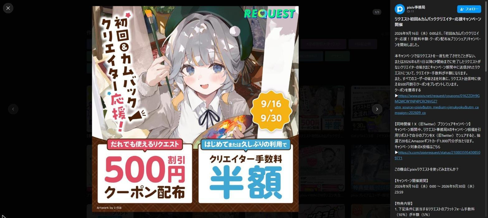
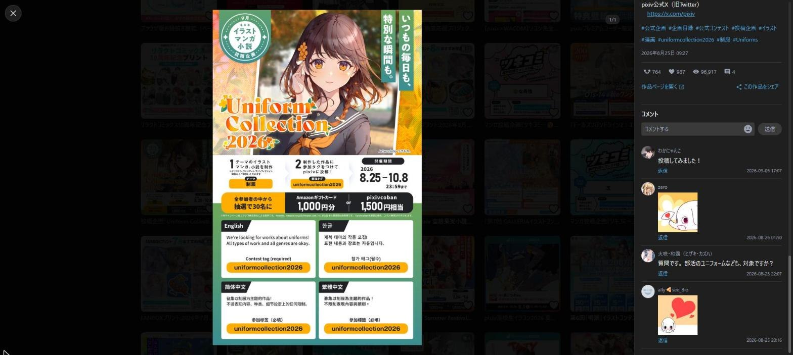
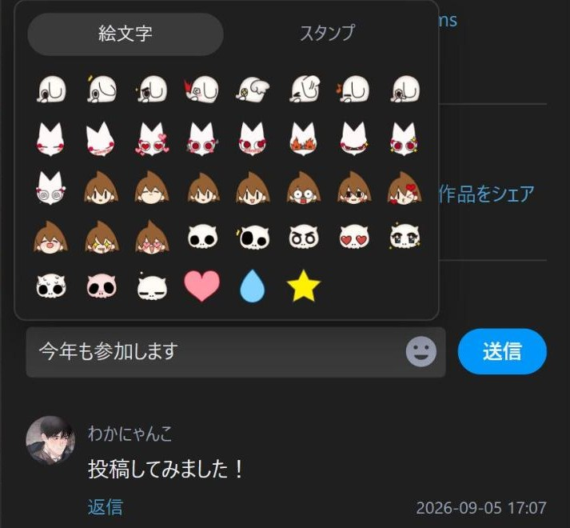

<div align="center">


# XViewer for Pixiv

**pixiv のユーザーページに、X.com のメディア閲覧に近い画像ビュワーを追加する Chrome 拡張機能**

[](package.json)
[](LICENSE)


</div>

---

> [!IMPORTANT]
> **これは pixiv プラットフォームを利用して開発した非公式の拡張機能です。**
> **ピクシブ株式会社が作成・配布しているアプリケーションではありません。**
> 同社とは一切関係がなく、提携・支援・推奨を受けたものでもありません。
> 利用によって生じた一切の結果については、利用者自身が責任を負うものとします。

---

## これは何か

pixiv のユーザーページで作品をクリックすると、**ページ遷移せずにその場でモーダルが開きます。**
複数枚の切り替え、うごイラの再生、投稿文やコメントの閲覧から、いいね・ブックマーク・フォロー・
コメントの投稿まで、モーダルの中で完結します。閉じれば元のグリッドの、元のスクロール位置に戻ります。



## 主な機能

### ビュワー

| | |
| --- | --- |
| **モーダルで開く** | グリッドのクリックを奪い、ページ遷移せずに表示する。URL は `/artworks/{id}` へ差し替わるので、リロードや共有もできる |
| **複数枚の切り替え** | `←` `→` と画面端の矢印でページ送り。前後の画像を先読みするので切り替えが速い |
| **作品の移動** | `↑` `↓` でグリッドの前後の作品へ。端まで来たら自動で次のページ分を読み足す。イラスト / 漫画タブではその種別の作品だけをたどる |
| **うごイラ** | zip を展開してフレームを組み立て、再生・一時停止に対応 |
| **原寸表示** | 画像をクリックすると、原寸のまま画面いっぱいに開く (pixiv の作品ページと同じ見え方)。左右の端か `←` `→` でページ送り (既定はオフ) |

### サイドバー

投稿文・タグ・投稿日・各種カウンタ・コメントが、画像の横に縦一列で並びます。



| | |
| --- | --- |
| **作品の情報** | 投稿文・タグ・投稿日・いいね / ブックマーク / 閲覧数と、作者のアイコン・フォローボタン |
| **コメントを読む** | スタンプと絵文字を画像で描画。返信の展開、続きの読み込みに対応。読み込みに失敗しても「再試行」から続きを読める |
| **コメントを書く** | 作品へのコメントと返信を、モーダルの中から投稿できる。絵文字とスタンプはパネルから選ぶ。自分のコメントは確認を挟んで削除できる |
| **アクション** | いいね、ブックマーク (Shift + クリックで非公開)、フォロー、シェア (X / Facebook / Pawoo / リンクのコピー)。別タブで済ませたいいねは二重に数えず、ログインが切れていればその旨を知らせる。自分の作品には 3 つとも出さない (pixiv 本体と同じ) |



### ユーザーページ

| | |
| --- | --- |
| **無限スクロール** | イラスト・マンガ一覧のページャ (1 2 3 …) を、下に続けて読み込む形にできる。URL の `?p=` は画面に出ているページへ追従するので、リロードしても同じあたりへ戻れる (既定はオフ) |
| **ピックアップを隠す** | プロフィールのホームに出る「ピックアップ」を隠し、作品一覧をすぐ目に入れる (既定はオフ) |
| **Tab 順の整理** | グリッドで Tab を押したときに、ブックマークとタイトルをフォーカス順から外せる (既定は pixiv 標準のまま) |

### そのほか

| | |
| --- | --- |
| **テーマ** | ビュワーは pixiv 本体のダーク / ライト設定に追従。設定画面は自分で切り替えられる |
| **設定の即時反映** | 画質・先読み・サイドバーの設定を変えると、開いている作品にもその場で反映される |
| **アクセシビリティ** | フォーカストラップ、`role="dialog"`、グリッドの Tab 順の整理。キーボードだけで開いて閉じるまで操作できる |

## 対応ブラウザ

Manifest V3 に対応した Chromium 系ブラウザ (Chrome / Brave / Edge など)。**Chrome 120 以上**が必要です
(コンテンツスクリプトの `"world": "MAIN"`、`color-mix()`、CSS nesting を使っています)。
Firefox / Safari には対応していません。

## インストール

現在ストアでは配布していません。ビルドして読み込んでください。

```bash
git clone https://github.com/NEONS-DESIGN/XViewer-for-Pixiv.git
cd XViewer-for-Pixiv
npm install
npm run build
```

1. `chrome://extensions/` を開く
2. 右上の **デベロッパーモード** をオンにする
3. **パッケージ化されていない拡張機能を読み込む** を押す
4. 生成された **`dist/`** フォルダを選ぶ

`src/` ではなく `dist/` を選んでください。ビルド後の成果物だけが動きます。

## 使い方

pixiv の**ユーザーページ** (`https://www.pixiv.net/users/{id}` 系) を開き、作品をクリックするだけです。

### キー操作

| キー | 動作 |
| --- | --- |
| `←` `→` | 同じ作品のページ送り (原寸表示中も同じ) |
| `↑` `↓` | 前後の作品へ移動 |
| `Ctrl` + `Enter` | コメントの入力欄で送信 (Mac は `Cmd` + `Enter`)。`Enter` は改行 |
| `Esc` | 手前にあるものから順に閉じる (絵文字パネル → 原寸表示・シェアメニュー → モーダル)。書きかけのコメントがあるときはモーダルを閉じない |
| `Tab` | モーダル内をフォーカス移動する (外へ出ない) |

コメントを書いている間は、`←` `→` `↑` `↓` はキャレットの移動に使われます (作品は動きません)。

### 設定

ツールバーのアイコンから開きます。変更はその場で保存され、開いているページにもすぐ反映されます。
「ライセンス」タブには免責事項と、同梱している第三者の成果物の表示が並びます。

| 区分 | 項目 | 既定 | 効果 |
| --- | --- | --- | --- |
| ビュワー | ビュワーを使う | オン | オフにすると pixiv 標準の動作に戻る |
| ビュワー | サイドバーを表示する | オン | 投稿文・タグ・いいね数・コメントを画像の横に出す |
| ビュワー | サイドバーのスクロール | サイドバーごと送る | 投稿文からコメントまでを 1 つにつなげて送るか、投稿文を固定してコメントだけを送るか |
| 画像 | 画像の解像度 | 標準 (長辺 1200px) | 原寸を選ぶと鮮明になるが読み込みは重くなる |
| 画像 | 先読み | 前後 1 枚 | 次のページを先に読み込んでおく枚数 (しない / 前後 1 枚 / 前後 3 枚) |
| 画像 | クリックで原寸表示 | オフ | 画像を押すと原寸のまま画面いっぱいに開く。上の解像度の指定にかかわらず原寸を読み込む |
| ユーザーページ | ピックアップ欄を隠す | オフ | プロフィールのホームに出る「ピックアップ」を隠す |
| ユーザーページ | 無限スクロール | 使わない | 下まで来たら読み込む / 常に 1 ページ先を読んでおく、から選ぶ |
| 操作 | 背景クリックで閉じる | オン | 画像の外側をクリックしたときに閉じるか |
| 操作 | グリッドの Tab 移動 | 飛ばさない | グリッドで Tab を押したときに、ブックマークとタイトルをフォーカス順から外すか |

設定画面の配色は、右上のアイコンからダーク / ライトを切り替えられます。初期状態は OS の設定に従い、
一度切り替えると以後はその配色で固定されます (「設定を初期化」で OS 追従に戻ります)。
この配色は設定画面だけのもので、ビュワーは pixiv 本体の設定に追従したままです。

## 注意事項

- **これは非公式の拡張機能です。** pixiv プラットフォームを利用して開発したもので、
  ピクシブ株式会社が作成・配布しているアプリケーションではありません。同社とは一切関係がありません
- **利用は自己責任です。** この拡張の利用によって生じた損害について、作者およびピクシブ株式会社は責任を負いません
- **R-18 作品の表示は pixiv 側の設定に従います。** 拡張側で年齢制限を回避することはしません
- **いいねは取り消せません。** これは pixiv の仕様で、押し間違えても元には戻せません
- **コメントの投稿・削除は pixiv 本体と同じ扱いです。** 押した分だけそのまま pixiv へ送られます。
  削除は元に戻せないので、2 段階の確認を挟んでいます
- **作品を収集する機能はありません。** ダウンロード機能も一括操作の自動化もありません。
  取得するのは、いま開いている作品とその前後の数枚だけです
- **無限スクロールは pixiv 本体と同じページ単位で読みます。** 1 ページ (48 件) ずつ、
  下へ進むのに合わせて取りに行くだけで、作品をまとめて取得することはありません
- **pixiv の仕様変更で動かなくなることがあります。** pixiv および関連サービスは予告なく機能や
  掲載内容の改訂・変更・提供停止を行う場合があります
- `/artworks/{id}` へ直接アクセスしたときや、検索結果・ランキング・タグページでは起動しません

これらは [ピクシブ株式会社 サービス利用規約](https://policies.pixiv.net/) の「登録商標のガイドライン &gt; アプリケーション、各種サービス等への使用について」に沿ったものです。

## 開発

| コマンド | 内容 |
| --- | --- |
| `npm run build` | `dist/` を作る |
| `npm run watch` | ビルドの監視モード |
| `npm test` | `node --test` でテストを走らせる (920 tests) |
| `npm run build:icons` | 拡張機能アイコンの PNG を生成する (生成物はコミット済み) |
| `npm run build:symbols` | UI のアイコン図形データを再生成する (生成物はコミット済み) |

バージョンの出どころは `package.json` の `version` だけで、ビルドが `dist/manifest.json` へ差し込みます。
対応 Chrome の下限 (esbuild の target と `minimum_chrome_version`) の出どころは `scripts/targets.mjs` です。

## ライセンス

[MIT License](LICENSE)

同梱している第三者の成果物については [`NOTICE`](NOTICE) を参照してください。
